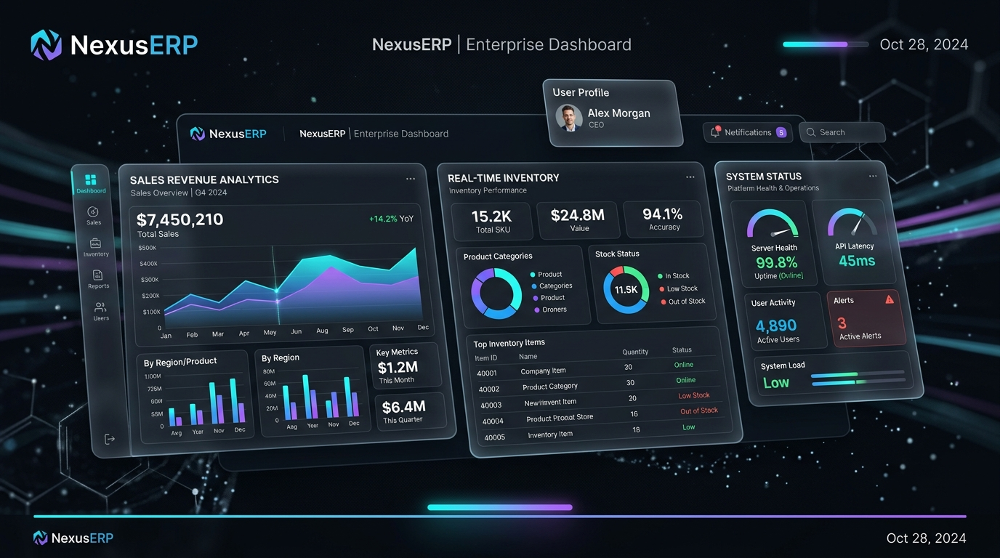
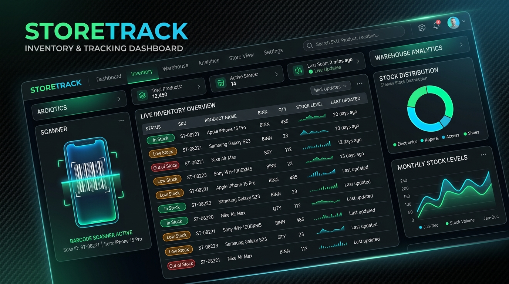
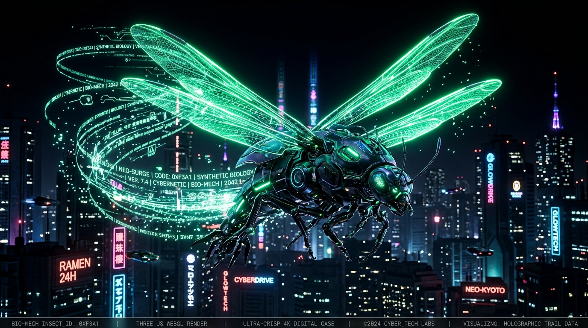
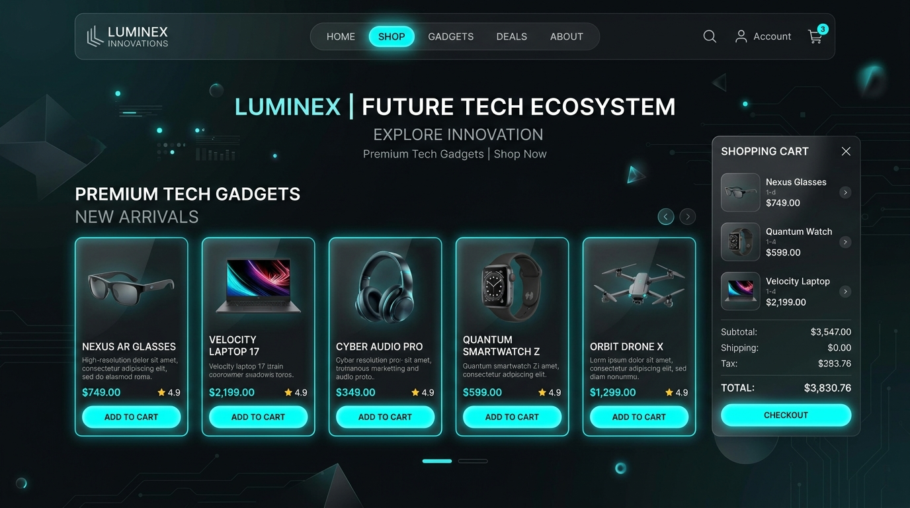
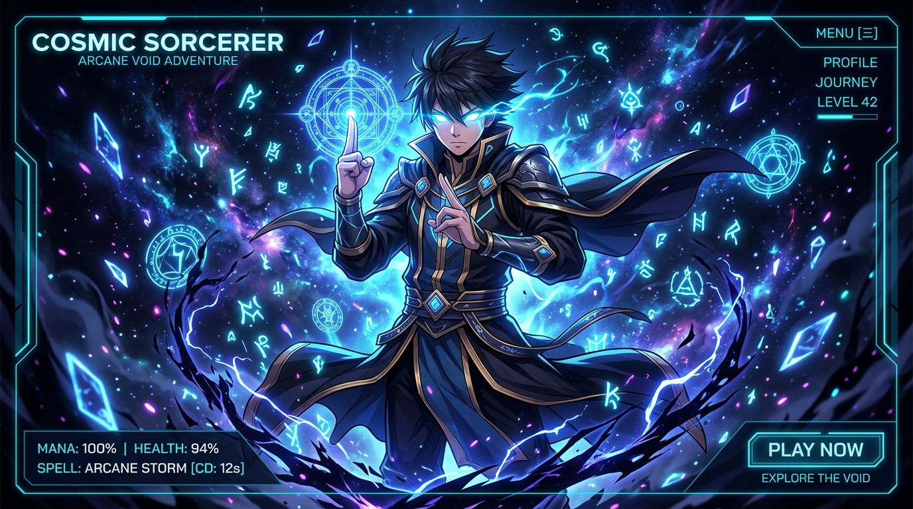
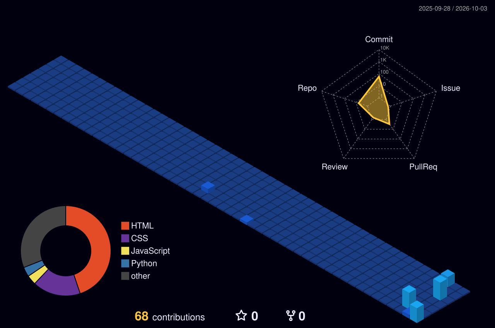

<!-- 🎬 HERO — video intro + name -->

  

<!-- 👨‍💻 LEFT: what I build   •   🏃 RIGHT: life outside code -->

  

<!-- ⚛️ TECH STACK -->

  

<!-- 🪪 DEVELOPER ID + DASHBOARD -->

  

## 🚀 Featured Projects & Systems

Here are some of the key platforms, enterprise systems, 3D WebGL animations, and interactive web experiences I have architected and built:

 

### 1. 🏢 NexusERP — Enterprise Resource Planning Platform
> *A full-stack, enterprise-grade ERP system built for end-to-end business operations, inventory lifecycle, and real-time operational analytics.*

  

- **Core Capabilities**: Real-time sales revenue analytics, multi-tier warehouse inventory tracking, role-based access management, barcode generation & scanning, and automated invoice/document reporting.
- **Tech Stack**: `React` `Vite` `Node.js` `Express` `Redux Toolkit` `Socket.io` `Recharts` `Framer Motion` `TailwindCSS`
- **Key Highlights**: Live data sync with WebSockets, interactive financial charts, barcode integration with JSBarcode, and high-performance state management.

 

---

 

### 2. 📦 StoreTrack — Smart Inventory & Warehouse Tracking PWA
> *High-performance Progressive Web Application (PWA) delivering real-time stock control, automated low-stock warnings, and dynamic spreadsheet data exchange.*

  

- **Core Capabilities**: Instant camera & hardware barcode scanning, live SKU management, offline-capable PWA architecture, automated low-stock and out-of-stock badge indicators, and dynamic Excel (`.xlsx`) import/export.
- **Tech Stack**: `React 19` `TypeScript` `Supabase` `TanStack Query & Table` `Recharts` `Zod` `Lucide` `TailwindCSS`
- **Key Highlights**: Built on React 19 and Supabase backend with virtualized tables for silky-smooth rendering across 10,000+ SKU records.

 

---

 

### 3. 🛸 Fly2.0 — 3D Three.js Scroll Animation & WebGL Experience
> *Cinematic 3D WebGL interactive scroll experience featuring a bio-mechanical creature (`demon_bee_full_texture.glb`), custom camera paths, and dynamic lighting.*

  

- **Core Capabilities**: Smooth scroll-triggered 3D model orientation, real-time GLTF/GLB texture rendering, responsive Three.js canvas viewport, and parallax environment layers.
- **Tech Stack**: `Three.js` `WebGL` `GLTF / GLB` `JavaScript` `CSS3` `HTML5`
- **Links**: [🌐 Live 3D Experience (Render)](https://fly2.onrender.com) • [💻 GitHub Repository](https://github.com/jaritrix02/fly2.0)

 

---

 

### 4. 🛍️ Website-Ecommerce — Modern Digital Gadget Storefront
> *A sleek, high-conversion e-commerce platform featuring an interactive product catalog, quick-view modals, dynamic cart drawer, and responsive checkout UX.*

  

- **Core Capabilities**: Filterable product catalog, interactive gadget showcase, cart drawer with instant subtotal and tax calculation, mobile-first responsive layout.
- **Tech Stack**: `JavaScript` `HTML5` `CSS3` `Responsive Web Design`
- **Links**: [🌐 Live Storefront Demo](https://jaritrix02.github.io/Website-Ecommerce/) • [💻 GitHub Repository](https://github.com/jaritrix02/Website-Ecommerce)

 

---

 

### 5. 🌌 Gojo Domain Expansion — Cinematic Interactive Web Experience
> *An Awwwards-inspired cinematic web experience featuring custom scroll-scrubbed frame animation, cosmic void audio-visual effects, and cyberpunk HUD overlays.*

  

- **Core Capabilities**: Scroll-driven video and canvas scrubbing, custom domain expansion soundscape, floating glowing Kanji runes, and dark neo-futuristic HUD layout.
- **Tech Stack**: `HTML5` `CSS3` `JavaScript` `GSAP` `Canvas API` `Web Audio`

 

---

 

### 6. 🎮 Interactive Game Engine & Utility Builds

| Project | Description | Stack | Links |
|:---|:---|:---|:---:|
| [**Portfolio**](https://github.com/jaritrix02/Portfolio) | Full-stack interactive developer portfolio with modern dark aesthetic and project showcase | `HTML` `CSS` `JS` | [🌐 Live Demo](https://jaritrix02.github.io/Portfolio/) |
| [**Rock-Paper-Scissors**](https://github.com/jaritrix02/GAME) | Interactive browser game with animated win/loss feedback and persistent scoring | `HTML` `CSS` `JS` | [🎮 Play Now](https://jaritrix02.github.io/GAME/) |
| [**Hindi TTS (gTTS)**](https://github.com/jaritrix02/hindi-tts-gtts) | Python automated Text-to-Speech tool leveraging Google TTS for Hindi voice synthesis | `Python` `gTTS` | [💻 Repository](https://github.com/jaritrix02/hindi-tts-gtts) |

 

 

## 🌃 My contribution city

*Every commit builds another tower — rebuilt automatically every day.*

  

<!-- 💌 LET'S CONNECT -->

  

 

**Always learning, always building.** 🚀

